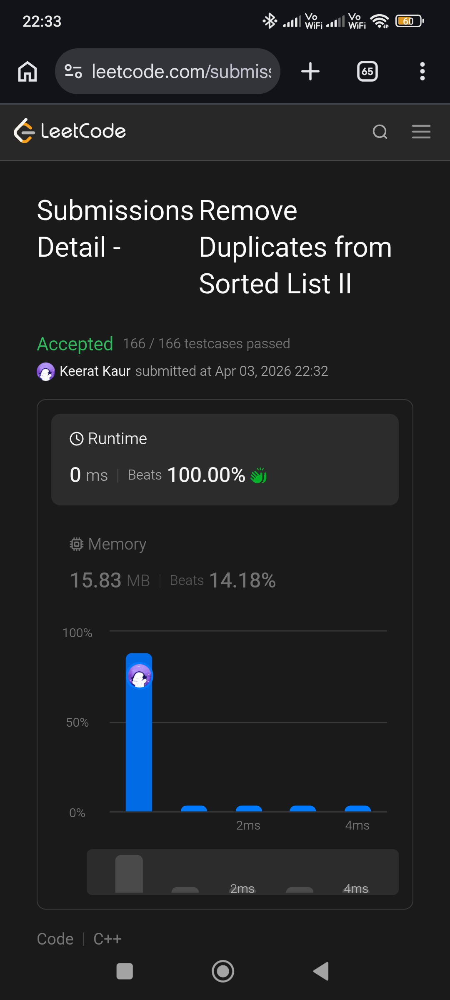

# Intermediate


```cpp
/**
 * Definition for singly-linked list.
 * struct ListNode {
 *     int val;
 *     ListNode *next;
 *     ListNode() : val(0), next(nullptr) {}
 *     ListNode(int x) : val(x), next(nullptr) {}
 *     ListNode(int x, ListNode *next) : val(x), next(next) {}
 * };
 */
class Solution {
public:
    ListNode* deleteDuplicates(ListNode* head) {
    ListNode nnode(0, head);
    ListNode *prev = &nnode;
    ListNode *curr = head;
    
    while(curr) {
        ListNode *nxt = curr->next;
        while(nxt && curr->val == nxt->val) {
            ListNode *temp = nxt->next;
            delete nxt;
            nxt = temp;
        }
        
        if(curr->next == nxt) {
            prev = curr;
        } else {
            prev->next = nxt;
            delete curr;
        }
        curr =  nxt;
    }
    
    return nnode.next;
    }
};
```
