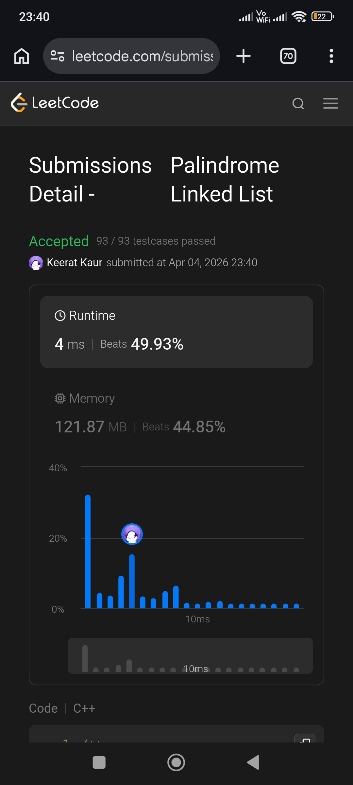

# Beginner


```cpp
/**
 * Definition for singly-linked list.
 * struct ListNode {
 *     int val;
 *     ListNode *next;
 *     ListNode(int x) : val(x), next(NULL) {}
 * };
 */
class Solution {
public:
    bool isPalindrome(ListNode* head) {
        
        
        ListNode *reverse = nullptr, *fast = head;
        while (fast && fast->next) {
            fast = fast->next->next;
            const auto head_next = head->next;
            head->next = reverse;
            reverse = head;
            head = head_next;
        }

        ListNode *tail = fast ? head->next : head;
 
        bool is_palindrome = true;
        while (reverse) {
            is_palindrome = is_palindrome && reverse->val == tail->val;
            const auto reverse_next = reverse->next;
            reverse->next = head;
            head = reverse;
            reverse = reverse_next;
            tail = tail->next;
        }
            
        return is_palindrome;   
    }
};
```
